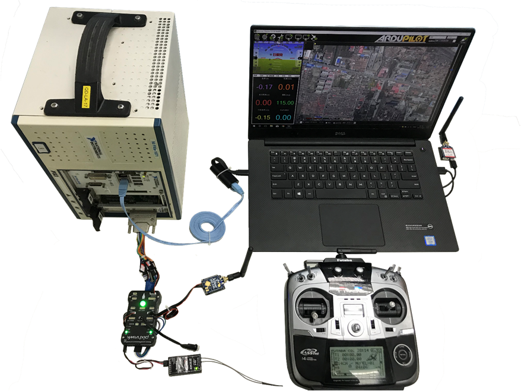

## 2. 平台介绍与总览

- 平台在Window7下开发完成

- 可以在Windows10上使用

- 后面的介绍全部基于Windows10操作系统。Windows7同样适用

- 该平台主要包括**PXI仿真计算机**（包含RT端**PXIe-8133**和FPGA端**PXIe-7846R**，本指南是基于这两个型号组合编写的，平台也是基于此开发的）、**飞控**、连接线、以及一台配置好的**PC上位机**。

- 本项目全部文档、软件、项目文件全部存放在文件夹`基于PXI的半物理实时仿真平台`中，其中：

  - 文件夹`软件包`中存放了本平台需要的软件平台安装包，使用本平台需要先安装文件夹中的软件，**本软件包不包含Matlab2016b**。
  - 文件夹`项目文件`中存放本平台使用的项目文件，需要安装`软件包`中的软件后才可以使用

- 文件夹`软件包`中文件关系说明如下，[软件版本兼容性请点此查看](http://www.ni.com/product-documentation/54028/en/)

  
  <table class="tg">
    <tr>
      <th class="tg-c3ow">安装顺序</th>
      <th class="tg-c3ow">软件名</th>
      <th class="tg-c3ow">文件名</th>
      <th class="tg-c3ow">用途</th>
      <th class="tg-c3ow">备注</th>
    </tr>
    <tr>
      <td class="tg-g6ne">1</td>
      <td class="tg-g6ne">Visual Studio 2010 32bit</td>
      <td class="tg-g6ne">VS2010_x86.iso</td>
      <td class="tg-g6ne" rowspan="2">用来编译Simulink模型的工具链</td>
      <td class="tg-g6ne"></td>
    </tr>
    <tr>
      <td class="tg-uys7">2</td>
      <td class="tg-uys7">Visual Studio 2010 32bit SP1</td>
      <td class="tg-uys7">VS2010SP1dvd1.iso</td>
      <td class="tg-uys7"></td>
    </tr>
    <tr>
      <td class="tg-g6ne">3</td>
      <td class="tg-g6ne">Matlab2016b</td>
      <td class="tg-g6ne"></td>
      <td class="tg-g6ne">修改、编译模型</td>
      <td class="tg-g6ne">从实验室网盘获取</td>
    </tr>
    <tr>
      <td class="tg-uys7">4</td>
      <td class="tg-uys7">VeriStand 2017</td>
      <td class="tg-uys7">VeriStand2017.iso</td>
      <td class="tg-uys7">为Matlab/Simulink 提供适用于PXI和Labview的TLC文件 Simulink使用该TLC文件编译生成的模型（*.dll）文件 才能供Labview以及PXI机箱使用</td>
      <td class="tg-uys7"></td>
    </tr>
    <tr>
      <td class="tg-lyaj">5</td>
      <td class="tg-lyaj">Labview2017 32bit</td>
      <td class="tg-lyaj">LVPLAT2017.iso</td>
      <td class="tg-lyaj">用于运行仿真平台</td>
      <td class="tg-lyaj"></td>
    </tr>
    <tr>
      <td class="tg-s6z2">6</td>
      <td class="tg-s6z2">LabVIEW 2017 FPGA Module  Xilinx Compilation Tools for Windows</td>
      <td class="tg-s6z2">2017FPGA-WinVivado2015.4.iso</td>
      <td class="tg-s6z2">Labview FPGA编译工具链</td>
      <td class="tg-s6z2"></td>
    </tr>
    <tr>
      <td class="tg-lyaj">7</td>
      <td class="tg-lyaj">SPI模块</td>
      <td class="tg-lyaj">IEDriver.rar</td>
      <td class="tg-lyaj">NI提供的用于Labview FPGA使用的SPI底层模块</td>
      <td class="tg-lyaj"></td>
    </tr>
    <tr>
      <td class="tg-s6z2">8</td>
      <td class="tg-s6z2">FlightGear2016</td>
      <td class="tg-s6z2">FlightGear-2016.1.2.exe</td>
      <td class="tg-s6z2">可视化软件，仅仅显示功能</td>
      <td class="tg-s6z2"></td>
    </tr>
    <tr>
      <td class="tg-lyaj">9</td>
      <td class="tg-lyaj">四旋翼FlightGear模型</td>
      <td class="tg-lyaj">F450.zip</td>
      <td class="tg-lyaj">四旋翼的模型，用于FlightGear中显示</td>
      <td class="tg-lyaj"></td>
    </tr>
    <tr>
      <td class="tg-s6z2">10</td>
      <td class="tg-s6z2">TestCase数据库</td>
      <td class="tg-s6z2">TestCase数据库安装.zip</td>
      <td class="tg-s6z2">测试用例数据库，用来自动化测试使用</td>
      <td class="tg-s6z2"></td>
    </tr>
    <tr>
      <td class="tg-lyaj">11</td>
      <td class="tg-lyaj">TestCases</td>
      <td class="tg-lyaj">TestCases.zip</td>
      <td class="tg-lyaj">测试用例注入程序</td>
      <td class="tg-lyaj"></td>
    </tr>
    <tr>
      <td class="tg-s6z2">12</td>
      <td class="tg-s6z2">NI License Activator V1.1</td>
      <td class="tg-s6z2">NI License Activator V1.1.exe</td>
      <td class="tg-s6z2">用来激活Labview、VeriStand等NI出品的软件</td>
      <td class="tg-s6z2"></td>
    </tr>
    <tr>
      <td class="tg-lyaj">13</td>
      <td class="tg-lyaj">卸载工具</td>
      <td class="tg-lyaj">卸载工具.rar</td>
      <td class="tg-lyaj">卸载NI软件</td>
      <td class="tg-lyaj">卸载不干净时尝试使用 正常请从控制面板卸载</td>
    </tr>
  </table>

- `项目文件`中主要包含SImulink模型文件以及Labview2017项目文件用于运行仿真平台

- 硬件布局如下图（白色机箱就是PXI**仿真计算机**，图中笔记本称之为PC**上位机**）：

  

- 使用该平台，首先需要将硬件搭建好，效果见上图。硬件的搭建需要将飞控与PXI机箱连接（见第四章）。还应该将PXI机箱与PC机都连接在**同一个局域网中**。软件部分则需要在PC机中安装好对应的软件（见第三章），另外PXI机箱可能也需要通过PC机安装对应的软件（见第四章）。这些在下文中有详细介绍。

- 本指南以**Pixhawk飞控**和**PX4 1.6.5版本固件**为准编写。