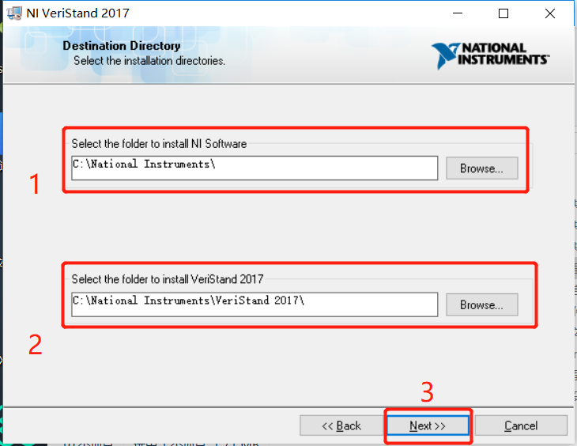
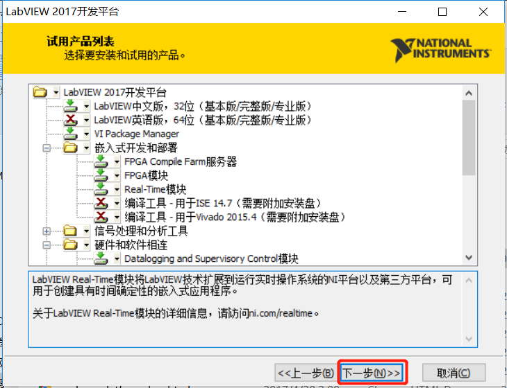
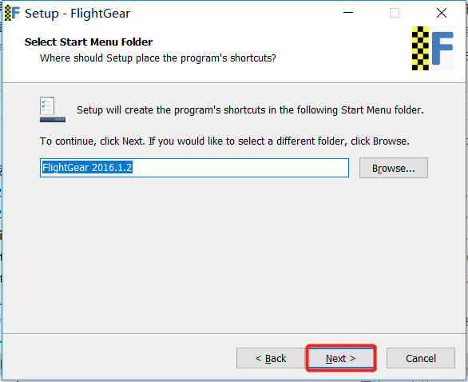
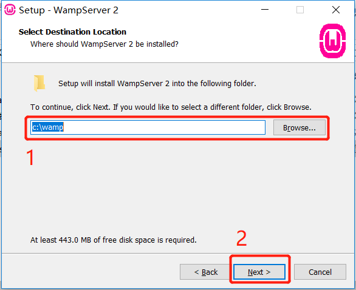
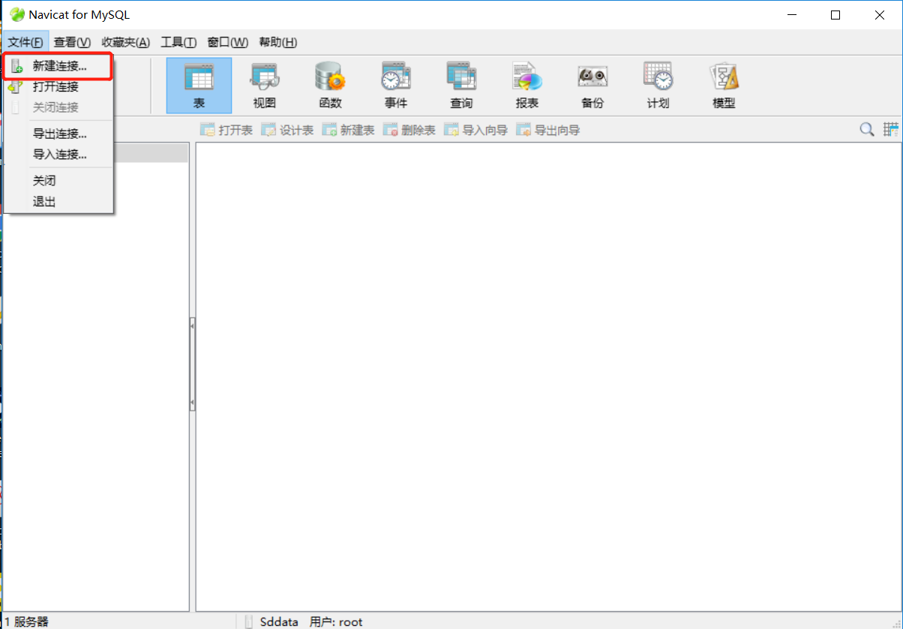

## 3. 安装（安装软件过程中请`关闭杀毒软件`）

### 3.1 Visual Studio 2010 32bit

进入文件夹`软件包`找到文件`VS2010_x86.iso`解压后，（**或者用虚拟光驱挂载镜像，下同；WIn10可以直接打开ISO文件,下同**），后进入解压后的文件夹运行其中的`setup.exe`程序，之后按照弹出的界面提示安装。

> - 尽量将**Visual Studio 2010 32bit**和后面的 **Visual Studio 2010 32bit SP1、Matlab2016b、VeriStand 2017、Labview2017 32bit**安装在同一个盘符，避免后面编译的时候出现各种问题。其他软件不对安装位置做特殊要求。
> - 如果有的话，请安装所有可以选择的组件


### 3.2 Visual Studio 2010 32bit SP1

进入文件夹`软件包`找到文件 `VS2010SP1dvd1.iso`解压后，进入解压后的文件夹，运行 `Setup.exe`然后按照提示安装。

> - 尽量将所有软件安装在同一个盘符中，否则使用时可能出错。
> - 如果有的话，请安装所有可以选择的组件。


### 3.3 Matlab2016b

从实验室网盘或者其他位置，找到`Matlab2016b`的安装包，安装即可。

> - 如果是第一次安装，请自行网上找教程


### 3.4 VeriStand 2017

进入文件夹 `软件包`找到文件 `VeriStand2017.iso`解压后，进入解压后的文件夹 $\rightarrow$ 进入路径 `\2017\17.0.0\VERISTAND`找到文件 `autorun.exe`运行后，按照下面***图示***的步骤操作即可。

> - 将本软件安装在与`Visual Studio 2010 32bit`相同的盘符中





> **选中上图中所有组件**


重启后完成安装。


### 3.5 Labview2017 32bit

进入文件夹 `软件包`找到文件 `LVPLAT2017.iso`解压后进入解压后的文件夹，找到安装程序 `autorun.exe` 运行后，按照下面***图示***以及***提示***操作即可


在接下来弹出的界面中，选择需要的组件，如下几幅图：


> 在选择 `FPGA模块`的时候回提示你是否安装依赖的产品，如下图，这里选择 `否`。这里询问的其实是FPGA所需要的编译工具，这个工具稍后我们另行安装。


> 记得勾选上图中的`设备驱动程序`




> 路径盘符请选择前面软件安装时所使用的盘符，也就是所有软件安装在同一盘符中


> 等待安装完成即可。


重启以完成安装。


### 3.6 LabVIEW 2017 FPGA Module Xilinx Compilation Tools for Windows

在文件夹 `软件包`中找到`2017FPGA-WinVivado2015.4.iso`解压后，进入解压后的文件夹，找到`autorun.exe` 运行。之后按照下面**图示**和**提示**操作即可。


完成安装。


### 3.7 SPI模块

**方法一**、在文件夹 `软件包`中找到 `IEDriver.rar` 解压，将解压后的文件夹复制到Labview安装目录中，也就是路径 `.\National Instruments\LabVIEW 2017\vi.lib\` 。复制后的效果如下图：


> 举例：如果在安装Labview的时候只修改了默认路径的盘符，那么应该复制到这个目录中 `X:\Program Files (x86)\National Instruments\LabVIEW 2017\vi.lib\`，`X`表示Labview的安装盘符。

**方法二**、

> 使用该方法前，请先激活NI所有软件，激活方法参见下文中 `3.12 NI License Activator V1.1`

1. 在开始菜单中找到 `VI Package Manager`打开，如下图：

    

2. 稍等片刻

    

3. 第一次打开需要等待较长时间。等待其完成刷新列表。

    

4. 按照下图所示顺序，操作。

    

5. 如果出现图示对话框，按照下图操作：

    

6. 又出现下图提示，如图，选择接受。

    

7. 之后可能会弹出Labview2017的启动界面，不用理会。等待直到出现下图内容，表示安装完成。

    

8. 到这里SPI模块就安装完成了。


### 3.8 FlightGear2018

进入文件夹 `软件包`找到文件 `FlightGear-2016.1.2.exe`双击运行后，按照下面**图示**和**提示**操作即可：





> 安装过程会弹出下图，安装界面点击 `OK`继续安装即可。


到这里就安装完成了。


### 3.9 四旋翼FlightGear模型

安装完成 `FlightGear`后需要将我们的旋翼无人机模型手动导入，用以显示仿真效果。

进入 文件夹`软件包`找到文件 `F450.zip`将其解压后，放到FlightGear的安装目录中去，具体路径是 `.\FlightGear 2018.3.2\data\Aircraft`

> 举例：比如FlightGear安装在了默认路径中，即 `C:\Program Files\FlightGear 2018.3.2`那么将**解压后**的`F450.zip`即文件夹 `F450`复制到`C:\Program Files\FlightGear 2018.3.2\data\Aircraft`中，复制后的目录结构如下图，请复制后与下图比对，检查路径结构是否与图中一致。
>
> 

安装好模型后如何启动？在 `软件包`目录下找到文件`runfg-HILonPXI.bat` 用**记事本**或者其他**文本编辑器**打开按照如下进行相应修改（<u>**不要直接复制下面的脚本内容，否则可能会因为复制产生的多余字符导致脚本无法运行**</u>）：

```bat
C:
cd C:\Program Files\FlightGear 2018.3.2

SET FG_ROOT=C:\Program Files\FlightGear 2018.3.2\data
.\\bin\fgfs --aircraft=F450 --fdm=null --native-fdm=socket,in,30,192.168.199.129,5502,udp --native-ctrls=socket,out,30,192.168.199.129,5505,udp --fog-fastest --disable-clouds --start-date-lat=2019:03:01:21:00:00 --disable-sound --in-air --disable-freeze --airport=PHNL --runway=08L --altitude=1 --heading=0 --offset-distance=0 --offset-azimuth=0 --timeofday=noon
```

> 代码说明：上面代码中
>
> - 第一行：请将 `C`修改为`FlightGear`软件的安装盘符
> - 第二行：将 `C:\Program Files\FlightGear 2018.3.2`替换为自己的`FlightGear`安装路径，建议安装时使用默认路径，或者只修改盘符，这样第二行代码你只需要修改对应的**盘符**即可
> - 第四行：同样将其中的 `C:\Program Files\FlightGear 2018.3.2`修改为自己的 `FlightGear`的安装路径，如果只是盘符不同，修改**盘符**即可。
> - 第五行以及后面：将第五行以及后面的IP地址（显然一共有两个IP地址）修改为自己电脑所在局域网的IP地址， 即，将**两个**`192.168.199.129` **都修改为自己的局域网IP，这两个一定要相同**，如何查看自己的局域网IP请网上搜索，有很多方法。
> - 全部修改完成后，保存退出。双击运行即可。脚本文件可以放在磁盘的任何位置，这里没有特别的要求。
>
> 


### 3.10 TestCase数据库

1. 进入文件夹 `软件包`找到文件 `TestCase数据库安装.zip` 后解压，进入解压后的文件夹

    

2. 进入解压后的文件夹后看到下图中内容，将图中红框中的文件件夹复制到自己喜欢的位置，复制的路径最好不要有中文。复制后，进入该文件夹即 `Navicat for MySQL`内，里面还有一个文件夹也是 `Navicat for MySQL`，进入。也就是路径 `.\Navicat for MySQL\Navicat for MySQL`中，在里面找到程序文件 `navicat.exe`，这个文件就是执行程序，这是一个绿色软件不需要安装，为了方便起见，**在桌面创建一个快捷方式**。

    

3. 回到文件夹 `TestCase数据库安装`中， 选择下图中红色框中的软件，运行之。

    

4. 出现下面安装界面，之后按照后面图示操作，

    

    

    

    

    

    

5. 安装过程中会弹出下面对话框，直接选择 `打开`即可。

    

6. 这里直接点 `Next`。再点击 `Finish`。

    

    

7. 安装完成后，回到电脑桌面，找到前面创建的快捷方式，双击运行。

    

8. 出现下图软件界面，菜单中选择`文件`$\rightarrow$ `新建连接...`如图：

    

9. 在弹出的界面中，按照下图所示输入图中内容 `localhost`和`3306`，最后点击 `确定`。

    

10. 如下图，**双击**图示连接 `localhost_3306`，之后，**右键**出现快捷菜单中，选择 `新建数据库...`：

    

    如图：

    

    如图：

    

11. 在弹出的对话框中，输入下图中所示内容 `sddata`，然后点击 `确定`

    

12. 然后在==**双击**==新建的数据库 `sddata` ，然后**右键**在快捷菜单中选择 `运行SQL文件...` :

    

    如图：

    

13. 在弹出的对话框中，点击右侧的按钮（图中红框标出的按钮）

    

14. 导航到 `软件包` $\rightarrow$ `TestCase数据库安装`，选择文件 `sddata.sql`，然后点击打开，如图所示：

    

15. 随后回到下图界面，点击 `开始`按钮，

    

16. 出现下图，进度条走完后，点击关闭。就完成了测试用例数据库的安装。之后关闭该软件。

    


### 3.11 TestCases

进入文件夹 `软件包` 找到文件 `TestCases.zip`。


解压后复制到自己喜欢的路径中，路径中最好不要包含中文。依然是绿色软件，不需要安装。复制后，进入文件夹内，找到可执行程序 `testcases.exe`，这就是本软件的执行程序。方便起见，请创建桌面快捷方式。

### 3.12 NI License Activator V1.1

在文件夹 `软件包`中找到 `NI License Activator V1.1.exe`，右键以管理员身份运行，出现


将鼠标放在需要激活的软件名字前，右键。如下图：


选择 `Active`完成激活。之后将所有软件按照这个方法激活，完成后如下图：


关闭软件完成激活。

> 卸载这些软件前先使用激活工具反激活，和激活操作相同。


### 3.13 卸载工具

在文件夹 `软件包`中找到 `卸载工具.rar`解压，进入解压后的文件夹，里面就是卸载工具。具体用法和说明请看下文中 `5. 卸载`。


### 3.14 QGC地面站

在文件夹`软件包`中找到`QGroundControl-installer_3.2.7.exe`双击运行安装。

> 飞控PX4固件版本与QGC地面站版本有些对应关系，所以QGC地面站不建议使用太新的版本，使用提供的版本即可。否则会出现无法正常连接飞控的问题


选择安装目录，点击安装即可


**如果是电脑第一次安装那么会提示安装驱动，按照提示允许安装即可**。