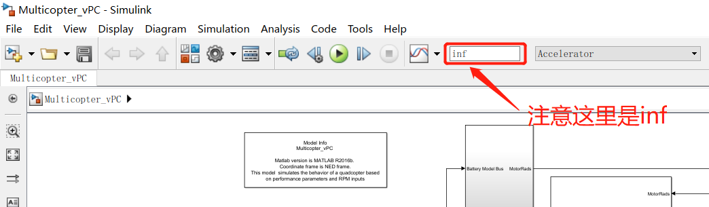
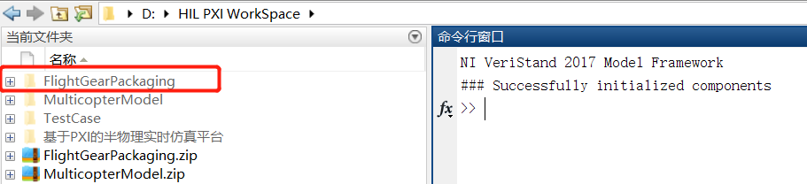
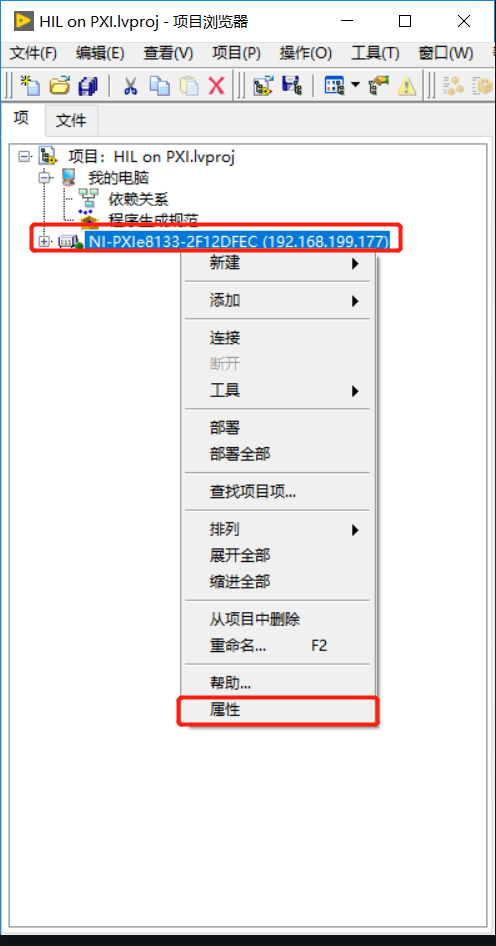
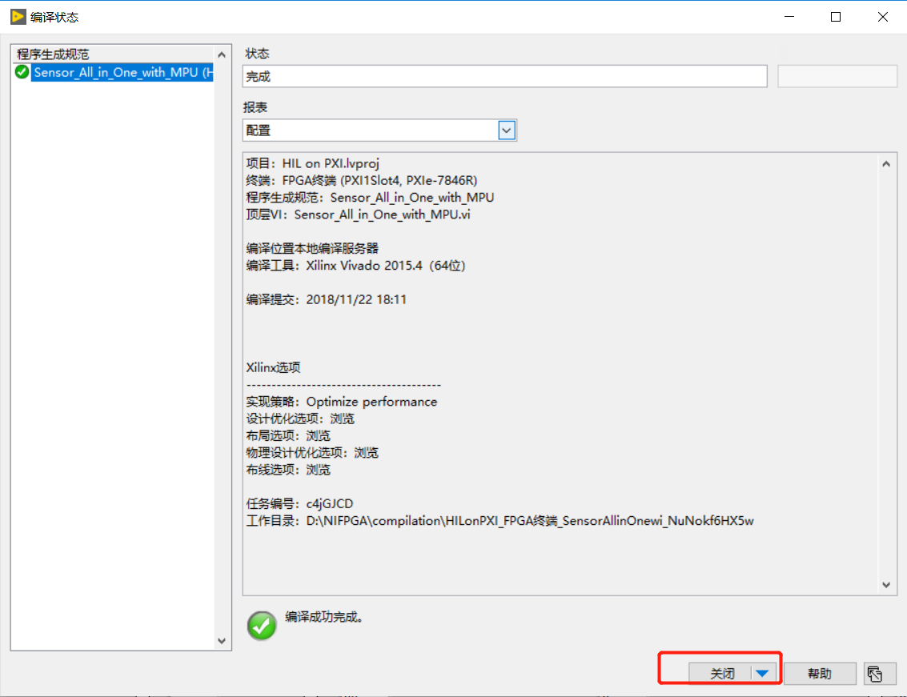
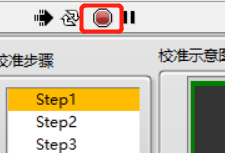

## 4. 配置与使用

### 4.1 PXI机箱与飞控接口

本节内容暂时只针对四旋翼X型布局介绍

使用到的PXI机箱上接口以及作用见下表

|    接口     |               用途                |
| :---------: | :-------------------------------: |
|   PWM输入   |   接收来自飞控的PWM电机控制信号   |
|     SPI     | 飞控与PXI机箱进行传感器数据的通信 |
|     CS      |       模拟传感器的片选引脚        |
| GPS（UART） |       向飞控发送GPS原始数据       |
|   PPM输出   |    PXI向飞控发送遥控器PPM信号     |
|   PPM输入   |    接收来自遥控接收机的PPM信号    |

下面是具体的介绍：

1. **PWM输入（电机接口）**

    本仿真平台所用的Simulink模型以及Pixhawk全部按照下面图示电机序号统一设置，这也是一种通用的设置方案：

    

    PXI机箱引出的四条PWM信号输入线（用于接收飞控发出的电机驱动信号）线序是

    | 线序 | 含义 | 电平  |
    | :--: | :--: | :---: |
    |  1   | PWM1 | +3.3V |
    |  2   | PWM2 | +3.3V |
    |  3   | PWM3 | +3.3V |
    |  4   | PWM4 | +3.3V |

    对应的飞控Pixhawk上顺序如下图：

    

    上图中**彩色箭头**标出的1、2、3、4 信号接口分别对应PXI机箱的PWM1、PWM2、PWM3、PWM4四条线。将他们对应连接即可。需要注意的是上图中从上数，第一排针脚是GND，第二排是VCC，第三排是信号，对于PWM自然就是PWM输出信号。

    > - **PXI机箱上的PWM四条信号线上在接口处标有序号**

2. **SPI（传感器通信接口）**

    这部分分为两部分：

    - SPI接口
    - 传感器片选CS接口

    PXI机箱：

    机箱上的SPI接口共有四根线，线序和意义如下

    | 线序 |   含义    | 电平  |
    | :--: | :-------: | :---: |
    |  1   |    SCL    | +3.3V |
    |  2   | MISO(OUT) | +3.3V |
    |  3   | MOSI(IN)  | +3.3V |
    |  4   |    GND    | +3.3V |
   

    > **注：PXI一侧为SPI从机**

    机箱上的CS接口共有四根线，线序和对应的传感器如下

    | 线序 |  含义   | 电平  |          备注          |
    | :--: | :-----: | :---: | :--------------------: |
    |  1   | LSM303D | +3.3V | 磁力计和加速度计、温度 |
    |  2   | MS5611  | +3.3V |      气压计、温度      |
    |  3   | MPU6000 | +3.3V | 加速度计和陀螺仪、温度 |
    |  4   | L3GD20  | +3.3V |      陀螺仪、温度      |

    Pixhawk：

    对于新的飞控板需要将自有传感器取下，将**SPI**线和**CS**线引出，然后按照前面所述对应连接即可。如果手里已有做好接口的飞控，那么接口处应该标出了对应线序，按照接口处的标记连接即可。也可以做成防反插类型接口。

    > **注：SPI不同于串口，SPI通信是自身MOSI引脚与对方MOSI引脚连接，自身MISO引脚与对方MISO引脚连接，SCK引脚与SCK引脚连接**
    >
    > **串口则是，自身RX引脚与对方TX引脚连接，自身TX引脚与对方RX引脚连接**

3. **GPS串口**

    PXI机箱的GPS（串口）接口线序以及含义如下：

    | 线序 |  含义   | 电平  |
    | :--: | :-----: | :---: |
    |  1   | RX(IN)  | +3.3V |
    |  2   | TX(OUT) | +3.3V |
    |  3   |   GND   |  GND  |

    Pixhawk上的GPS接口按照其外壳上的标注连接，如下图红框所选就是GPS接口，红点一侧为1号引脚，每个引脚含义下表列出：

    

    | 序号 |       含义        | 电平  |
    | :--: | :---------------: | :---: |
    |  1   |  VCC（没有用到）  |  +5V  |
    |  2   |      TX(OUT)      | +3.3V |
    |  3   |      RX(IN)       | +3.3V |
    |  4   | CAN2 TX(没有用到) | +3.3V |
    |  5   | CAN2 RX(没有用到) | +3.3V |
    |  6   |        GND        |  GND  |

    根据以上说明连接飞控与PXI机箱即可。如果已有做好接线的飞控，请按照接线接口处的标识连接。

4. **PPM输出**

    > 此接口是用来做接收机故障测试时使用的，如果不做这方面的测试，可以将遥控接收机信号线直接连接到飞控上，无需使用该接口。

    该接口只有两根线（口），一个是地线，一个是信号线，这里的信号线用来发送PPM信号给飞控。根据接口具体情况，将该接口与飞控上对应的RC口连接即可。对于Pixhawk如下图，位于红框位置，从上向下三个针脚分别是 GND、+5V、PPM。将接口与对应的PXI机箱上的PPM输出接口连接即可。**机箱上的PPM接口有响应的标记。**

    

5. **PPM输入**

    > 同样，如果不是使用接收机故障测试功能，不需要使用该接口，直接将接收机与飞控连接即可。

    该接口只有两根线（口），一个是地线，一个是信号线。这里的信号线用来接收来自接收机发出的PPM信号。具体接收机上的PPM信号接口，一般需要转接模块转换才能得到PPM信号，转接模块上清楚地标出PPM信号针脚的位置。请具体查看转接模块上标记。

    这里给出连接实物图，后期看到的可能与本图有出入，以实物为准。

    

    

### 4.2 Matlab/Simulink模型介绍与编译

下面介绍Simulink模型编译。

首先，`项目文件`中存放了我们需要的Simulink模型。Simulink模型共三个（在其中两个压缩包中 `MulticopterModel.zip`，`FlightGearPackaging.zip`）：

- 多旋翼模型（核心）位于 `MulticopterModel.zip`中；
- 执行校准模型（用来模拟多旋翼的校准过程，使得飞控可以通过校准流程）位于 `MulticopterModel.zip`中；
- FlightGear显示数据打包模型（用来将需要发送给FlightGear的数据打包）位于 `FlightGearPackaging.zip`中。

编译原理：

- 利用Simulink生成代码的功能，Simulink会将我们提供的模型编译生成适用于Labview的代码（需要VeriStand2017提供支持，已经安装）；
- 调用VS2010提供的编译工具链，将生成的代码编译成 `*.dll`文件。

上面两条都是Simulink自动完成的，过程不需要人为干预。生成的 `*.dll`文件才可以由Labview调用（如何调用见下一节）。本节介绍如何编译模型最后生成 `*.dll`文件。

1. 进入文件夹 `项目文件`里面有三个压缩包，如下图。找到图中标出的文件，将其复制到另外的地方（路径中不要有中文名）。

    

2. 将复制后的两个压缩包，**分别解压缩到不同的文件夹中**，操作类似下图：

    

3. 解压后， 先进入文件夹`MulticopterModel`，如下图，可以看到里面有两个 `.slx`的模型文件，这两个文件就是我们需要的模型：

    

    > - 文件 `Init.m`是模型默认参数配置文件
    >
    > - 文件 `MavLinkStruct.mat`是模型总线定义文件

4. 首先用**Matlab2016b**打开文件 `Multicopter_vPC.slx`（多旋翼模型），

    > 打开Matlab2016b时，等待初始化完成后，应该看到下图中的两行内容，说明Matlab2016b已经成功加载VeriStand2017的支持文件：
    >
    > 

    请将Matlab工作文件夹导航到打开的模型所在的文件夹，如下图：

    

5. 视线转移到打开的模型中，编译前请确认几点注意事项（提供的模型默认情况下，可以直接编译），见下图

    

    之后点开下图中的设置按钮

    

    在弹出的设置窗口中，选择左侧的 `solver`，然后确认右侧的内容与下图标红的内容是一致的。

    

    下图同理，确认设置内容与下图相同：

    

    确认设置内容与下图相同，这里是要确保生成模型文件参数是可调的：

    

    下图中`NIVeriStand.tlc`就是前面提到的，VeriStand2017支持文件。确认图中标记处与设置相同

    

    确认设置内容与下图一致。

    

    确认无误后，点击 `OK`完成退出。

    

6. 然后编译：点击下图中所示按钮，编译模型。

    

    可以点开模型下面的蓝色提示查看编译进度，如下图

    

    下图中就是编译进度：

    > 如果编译失败，其中的错误也会在里面显示，可以根据错误细节解决问题

    

    编译完成后，会弹出编译报告（也可以在设置中关闭，建议开启）

    

    关闭报告后，查看Maltab资源管理器中出现了新生成的文件夹，如下图，里面就包含了生成的 `*.dll`文件,双击进入该文件夹：

    

    下图中标出的就是生成的模型

    

7. 回到上一级目录，找到另外一个模型文件 `Eular2IMU.slx` （执行校准模型），如下图，执行类似上面的操作，编译生成模型

    

    

    

    

8. 然后在进入之前解压的另外一个文件夹 `FlightGearPackaging`。如下图：

    

    类似的，检查模型设置，需要的注意的是这个模型（FlightGear显示数据打包模型）的步长是`0.01`

    

    

    点击编译：

    

    编译成功后，依然是在生成的文件夹中（见下图）找到对应的`.dll`文件。

    

    至此，三个模型都已经编译完成。

    > 模型的仿真步长实际是可以修改的：
    >
    > - 仿真步长过短，仿真平台无法按照指定时间完成。仿真平台执行一次模型所需的时间与该平台CPU运算能力有关。按照模型默认设置的步长，设定的周期是200us，仿真平台测试的可以达到的最短周期在100us以上。所以默认使用的仿真步长是0.0002s。
    > - 对于**FlightGear显示数据打包模型**的步长不建议设置太短，会增加仿真平台的负担，对于单纯的显示功能也没有必要。建议不要小于0.01

### 4.3 Labview2017 项目文件配置使用

#### 4.3.1 安装适用于PXI机箱的软件

在开始使用平台进行仿真之前，需要为PXI机箱安装软件。可能已经提前安装好了，就不需要安装了。

- **用网线将PXI机箱与局域网连接，这里需要用到PXI机箱上的1号网口（机箱上有标记，一看便知），将网线插入即可，打开PXI机箱电源**，稍等片刻，等它启动完成。
- 在之后的使用过程中，都要保持PXI机箱处于局域网中。

首先到开始菜单中找到下图中的软件 `NI MAX`：打开

打开软件后，点开远程系统。检索过后，就会出现，目标机箱

> 如果打开软件之后，没有出现上图中 `远程系统`那么可以尝试如下操作： `工具`  $\rightarrow$  `重置配置数据`
>
> 
>
> 然后会出现要求重启等，对话框。按照提示操作即可。重启后再次打开该软件，问题应该可以得到修复。

> 有时点开 `远程系统`后，并没有出现目标机箱，或者 `远程系统`下面什么都没有。这通常是防火墙造成的问题。如有，按照下面的方法解决。
>
> 如下图，选择远程系统后，到右侧上点击 `故障排查远程系统发现`：
>
> 
>
> 然后会出现下图，设置成下图所示的选项，点击下一步：
>
> 
>
> 由于使用的是2017版本，所以按照下图选择Labview2017，之后点击下一步：
>
> 
>
> 然后会看到下图，图中也显示该软件被防火墙阻挡，点击图中的 `Add Rules`添加规则，然后会弹出用户账户控制询问是否通过防火墙，选择是即可（其他时间弹出的对话框同样要选择是，不然会被防火墙阻挡，出现问题）
>
> 
>
> 允许通过防火墙后，变成下图的样子，点击下一步：
>
> 
>
> 接着会自动搜索，搜索完成后会出现下图的目标终端，如下图，然后点击下一步，之后就可以在远程系统下看到目标终端了，也就是我们的仿真计算机。
>
> 

下图中是搜索到的仿真计算机，如下图。点击左侧红色框中远程（局域网）计算机，看到右侧有机箱在局域网中的IP地址等信息。

之后点开远程计算机，选择`软件`右键选择`添加删除软件`，

在弹出的界面中，选择要安装的软件（**软件列表名字前面小图标上单击，可看到安装选项，选择安装即可**），除了下图中标出的软件不选，其他的全部选择安装，之后点击下一步

> 如果你完全熟悉这些软件的用途，也可以只选择必要的软件安装。

再次点击下一步：

等待安装完成：

点击完成后，退回到软件主界面，按照下图标记步骤操作，点击保存后确认是否重启，选择是：

等待重启完成，至此机箱内的软件安装完成。完成后将`NI MAX`关闭即可。

#### 4.3.2 仿真平台软件介绍

进入文件夹 `项目文件`，找到 `HIL on PXI.zip`，如下图：

将其复制到其他路径中，**路径中不要有中文名**，解压

进入解压后的文件夹，找到下图中的 `HIL on PXI.lvproj`,双击打开：

打开过程中，出现需要确认的对话框一律点确认通过（用户账户控制、防火墙等），打开后出现下图所示，**项目浏览器**，并按照下图所示，打开 `属性`：

打开后，单击窗口左侧 `常规`。，然后确认窗口右侧的IP地址是目前PXI机箱在当前局域网中的地址，确认之后点确定关闭即可。

> PXI机箱在局域网中的地址，在上文 `4.3.1 安装适用于PXI机箱的软件 `中有介绍。

接着，按照下图打开 `FPGA终端`的 `属性`：

在刚打开的窗口左侧单击 `常规`，确认窗口右侧 `资源`名称与实际是对应的。如果有疑问请继续往下看：

接着上图，如何查看上图中 `资源`一项的内容？如下图，打开 `NI MAX`软件（不知道从哪里找这个软件请看前文）按照下图指示操作，就可以看到上图中 `资源`一栏需要填写的内容。

回到项目浏览器中，按照下图操作：

下图，这里打开的就是FPGA中用来模拟传感器、串口、PWM、PPM的程序。按照下图点击运行，尝试运行（确认此时机箱已经打开，并且正确接入局域网中）

这时通常需要重新编译一次，期间弹出的任何对话框，都要点击确认或者保存（总之不要点取消）。

最后会进入编译界面，编译时间会比较长至少10分钟。

编译完成后，之前的程序框图会自动弹出，并自动运行，如下图：

单机下图中的红色按钮，停止运行。然后关闭该程序。

> 该FPGA程序，实际使用中不需要直接操作，而是通过其他VI程序调用实现的，这里只是确认该程序是否需要重新编译，且可以运行。

再将刚才的编译窗口关闭，如下图：

接下来要介绍运行仿真平台的主程序。但是在这之前，我们需要将之前编译好的三个Simulink模型（见上文中 `4.2 Matlab/Simulink模型介绍与编译`）也就是 `*.dll`文件，存放到正确的位置。如下图，打开 `NI MAX`软件，按照下图打开 `文件传输`：

在刚打开的文件夹中，进入文件夹 `ni-rt`，如下图：

将`4.2节`中编译好的三个模型文件复制到这个文件夹中，复制完成后关闭即可，如下图：

放置好模型文件后，视线回到项目浏览器中，双击打开下图中所示文件，这个就是整个仿真平台的 **主程序**：

> **主程序**的名字、版本在后面可能会有变化，请以实际为准。后面会起一个一看便知的文件名。

打开后就看到下图中的程序主界面，单机下图中红框标记的运行按钮（白色的箭头）。运行

第一次点击运行后，可能会弹出很多对话框，一律点确定一类的按钮，如下图

> 由于这是用来开发的项目，Labview会检测到一些变化，然后提示是否保存。实际上并没有什么变化，所以一律点保存或者确定等。弹出的对话框可能千遍万化，这里不能穷举。

最后就可以看到运行中的仿真平台主程序了，如下图：

> 主程序布局后期会有变化，请以实际为准。

**熟悉主界面之后**，先停止该程序，见下图，之后关闭程序文件。

到这里，整个仿真平台的安装配置简单运行已经通过，接下来就是具体的使用方法了。

### 4.4 基本使用流程

**阅读本章需要熟悉前面所有章节内容**

#### 4.4.1 飞控基本设置

对于一台全新空白的的Pixhawk飞控，通常需要顺序执行以下操作

|    刷固件    |                             图示                             |
| :----------: | :----------------------------------------------------------: |
|    刷固件    |  |
|   设置机型   |  |
|  遥控器校准  |  |
|  传感器校准  |  |
| 设置飞行模式 |  |

实际使用中需要校准传感器的情况比较多。显示红色的设置说明需要重新设置，如上传感器校准的指示图标。

本平台支持多种旋翼类型，这里以基本的X型四旋翼为例做简要说明。如下图所示按照序号操作，选择机型为`DJI Flame Wheel F450`之后选择右上角的`Apply and Restart`,待飞控重启完成后完成机型设置。也可以参照接下来提到的操作视频。

飞控无法解锁的时候根据QGC地面站的提示通常需要重新校准飞控。

关于以上的关键操作请参照文件夹 `操作视频`中的`飞控校准.mp4`。操作视频中几乎包含了除**刷固件**之外的所有操作演示。

>   本文档主要面向具有飞控背景的读者最好自身已经熟悉PX4、Pixhawk、QGC地面站。设置飞控部分并非本文重点，网上也有大量资料说明QGC地面站与Pixhawk如何使用的资料，也可以参考[QGC地面站官方文档](https://docs.qgroundcontrol.com/en/)。

#### 4.4.2 常规测试

> 本仿真平台用途，主要分为两类：**常规测试**和**故障测试**。故障测试分为两种，一种是**手动故障测试**，另一种是**自动化故障测试**。

准备工作：

- 确认**飞控**与PXI**仿真计算机**已经连接完好。
- 确认PXI仿真计算机和PC上位机接入**同一局域网中**
- 确认PC上位机，PXI仿真计算机**软件都已配置完好**。

第一步：打开仿真计算机电源，等待其启动完成，（类似于PC开机时间）；

第二步：确认模型文件 `*.dll`已经放置在仿真计算机中正确的位置；

第三步：通过前面提到的启动脚本，打开FlightGear；

第四步：打开PC上位机上的Labview项目，即打开项目文件 `HIL on PXI.lvproj`出现**项目浏览器**窗口；

第五步：在**项目浏览器**中打开仿真平台**主程序**，并点击**运行按钮**运行仿真程序；

第六步：接通飞控电源，等待10s左右的的时间，观察仿真平台**主程序**主界面上的传感器工作状态指示灯是否全部**闪烁**或者**接近常亮**。如果某几个传感器出现不闪烁的状态，说明飞控与仿真计算机建立连接失败，这时请断开飞控电源，重新上电，这时可能需要**重新校准飞控**。如果反复出现该问题，请检查连线；

> 事实上，飞控每向仿真计算机发送一字节数据，指示灯都会闪烁一下，如果数据量很大就会接近常亮。如下图：
>
> 

第七步：操作飞控安全开关，用遥控器解锁，或者安装地面站（地面站安装不做介绍，网上有教程），设置飞行任务等常规操作。可以在FlightGear中看到飞行状态。

> 执行第七步时就像正常操作真机飞控一样操作即可。包括但不限于，手动模式、定点、任务等。

#### 4.4.3 故障测试

同时参照文件夹`操作视频`中的`自动化测试.mp4`。

1. 手动故障测试：

    准备工作以及第一步至第六步与**常规测试**相同。这里省略。需要遥控器。

    第七步：解锁，启动飞控，使用遥控起飞（可以切换为定点定高模式等）

    第八步：打开`TestCases`软件，如下图，按照图中说明操作即可将故障注入到模型中，在FlightGear中可以看到效果。图中注入的是螺旋桨的故障，也可以注入其他的故障。

    

2. 自动化故障测试：

    准备工作以及第一步至第六步与**常规测试**相同。**但是需要注意的是，请在接通飞控电源前连接数传**。数传提前配对好，一边接PC上位机，一边接飞控。不需要遥控器

    第七步：打开软件 `WampServer64`如下图，也可以从开始菜单找到该程序，打开后在后台运行：

    

    第八步：打开`TestCases`软件，按照图中标注操作

    

    弹出新的窗口中，单击开始即可开始自动化测试，测试用例全部测试完成后，可以点击窗口右下侧 `生成报表`以生成Word报告。后面按照弹出的对话框提示操作即可。

    

    生成的报告在TestCases软件（不是桌面快捷方式）目录下的 `outputReport`文件夹中，可参考下图：

    

### 4.5 硬件接口与技术细节

关于PXI机箱上FPGA板卡接口引线可以参照下图，实际上也可以通过查看Labview中的FPGA程序框图得知硬件引脚的对应关系。主要使用FPGA板卡7846R上的Connector0接口，下图即是Connector0的接口映射。

