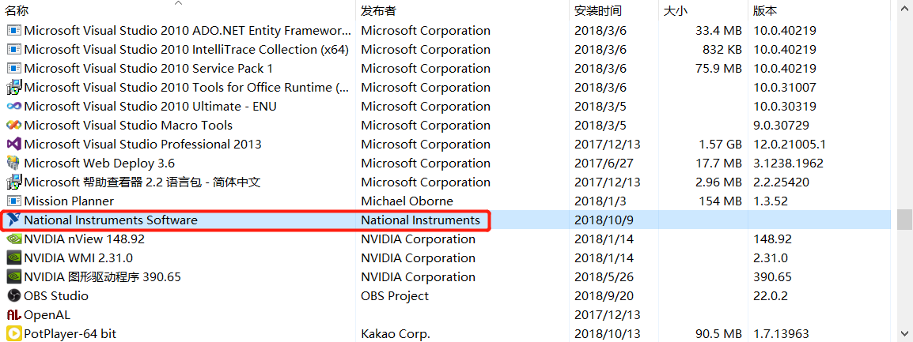
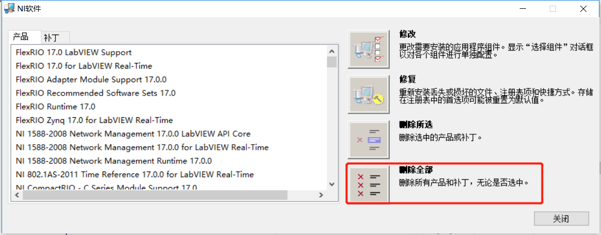
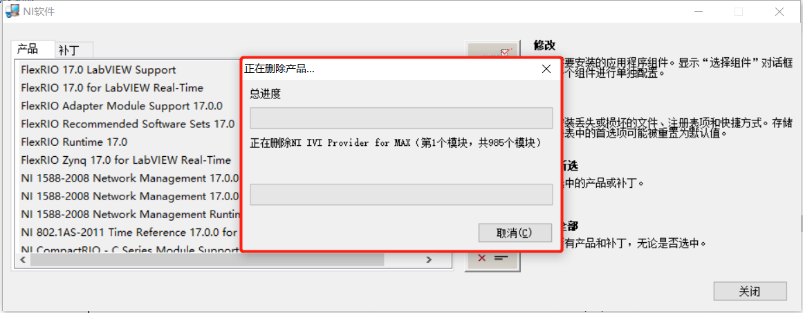
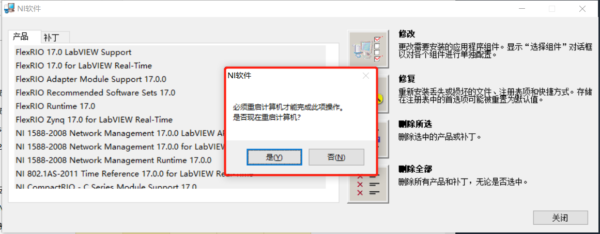
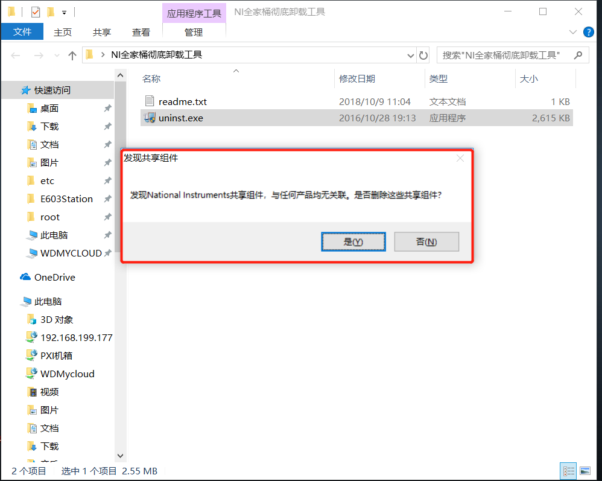

## 5. 卸载

Labview软件套件内容庞大，容易卸载不干净，导致无法重新安装，严重的导致重装系统。

0. 先使用激活工具`NI License Activator V1.1`反激活所有激活的软件

1. 使用软件自身卸载程序卸载

   打开`控制面板`$\rightarrow$`程序和功能` 

   

   双击上图中红色框中的项目，稍等片刻，出现下图内容：

   

   选择上图中红色框中的`删除全部`。

   > 注：如果提示确认是否删除，选择确认即可。

   

   接着出现上图内容，需要等待很久的时间。**不管提示与否，卸载完成后请重启。**

   

   如果遇到无法再次安装Labview组件的问题，可以尝试运行`软件包`中的如下软件，具体位置详见 `3.13 卸载工具`一节：

   

   > 注：这个软件在Windows7下成功使用过，但是有时会出现点击`是`之后无反应的情况。所以这个方法作为最后尝试。如果点击是后有反应，那么尝试再次卸载全部内容。Windows10测试时是没有反应的。